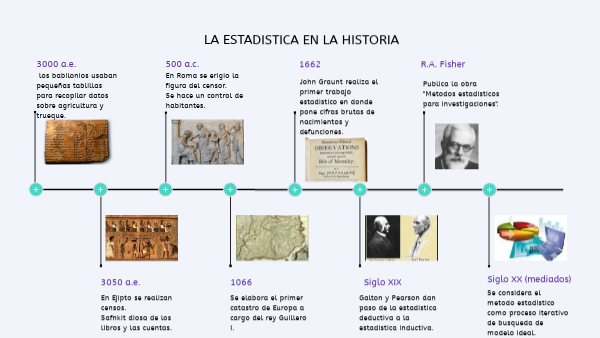
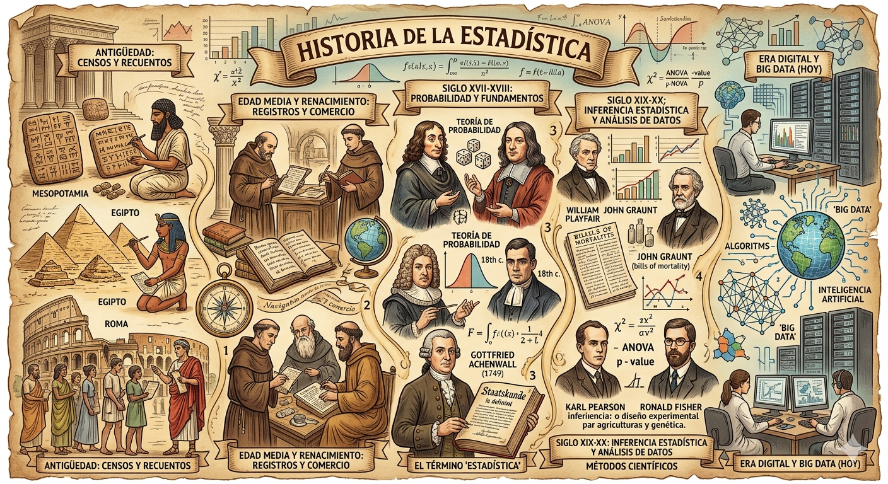
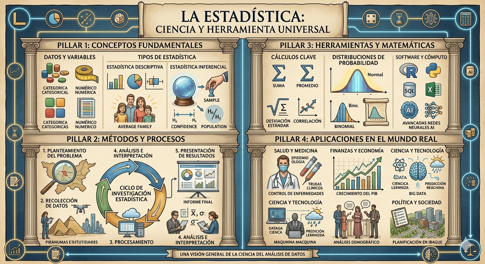

```{=html}
<div style="position: absolute; top: 10px; right: 20px;">
  
</div>
```

```{=html}
<style type="text/css">

/* ---------- CUERPO GENERAL ---------- */
body {
  font-size: 130%;
  text-align: justify;
}

/* ---------- TARJETAS DE CONCEPTO ---------- */
.concepto-card {
  background: rgba(255,255,255,0.07);
  border: 1px solid rgba(255,255,255,0.15);
  border-left: 5px solid #3892f8;
  border-radius: 10px;
  padding: 1.2rem 1.5rem;
  margin-bottom: 1.2rem;
  transition: transform 0.3s ease, box-shadow 0.3s ease, background 0.3s ease;
}
.concepto-card:hover {
  transform: translateY(-4px);
  box-shadow: 0 8px 24px rgba(56,146,248,0.25);
  background: rgba(255,255,255,0.12);
}
.concepto-card h4 {
  color: #3892f8;
  margin-bottom: 0.4rem;
  font-size: 1.05rem;
  letter-spacing: 0.03em;
}
.concepto-card p {
  margin: 0;
  font-size: 0.95rem;
  line-height: 1.6;
}
.concepto-card .ejemplo {
  margin-top: 0.5rem;
  font-size: 0.88rem;
  color: #aaa;
  font-style: italic;
  border-top: 1px solid rgba(255,255,255,0.1);
  padding-top: 0.5rem;
}

/* ---------- GRID DE TARJETAS ---------- */
.card-grid {
  display: grid;
  grid-template-columns: repeat(auto-fit, minmax(280px, 1fr));
  gap: 1.1rem;
  margin: 1.5rem 0;
}

/* ---------- BADGES ---------- */
.badge {
  display: inline-block;
  padding: 3px 12px;
  border-radius: 20px;
  font-size: 0.78rem;
  font-weight: 600;
  margin-right: 6px;
  letter-spacing: 0.04em;
}
.badge-nominal  { background: #1e3a5f; color: #6ab0f5; }
.badge-ordinal  { background: #1e3d2b; color: #5fcf8a; }
.badge-discreta { background: #3d2b1e; color: #f5a05f; }
.badge-continua { background: #3d1e2b; color: #f56a8a; }

/* ---------- TABLA VARIABLES ---------- */
.tabla-variables {
  width: 100%;
  border-collapse: collapse;
  font-size: 0.88rem;
  margin-top: 1rem;
}
.tabla-variables thead th {
  background: #144a8a;
  color: #fff;
  padding: 10px 14px;
  text-align: left;
  font-weight: 600;
  letter-spacing: 0.04em;
}
.tabla-variables tbody tr {
  border-bottom: 1px solid rgba(255,255,255,0.08);
  transition: background 0.2s;
}
.tabla-variables tbody tr:hover {
  background: rgba(56,146,248,0.12);
}
.tabla-variables td {
  padding: 8px 14px;
  vertical-align: middle;
}
.tabla-variables td:first-child {
  font-weight: 500;
  color: #e8e8e8;
}
.check {
  display: inline-block;
  width: 22px;
  height: 22px;
  border-radius: 50%;
  line-height: 22px;
  text-align: center;
  font-size: 13px;
  font-weight: bold;
}
.check-nominal  { background: #1e3a5f; color: #6ab0f5; }
.check-ordinal  { background: #1e3d2b; color: #5fcf8a; }
.check-discreta { background: #3d2b1e; color: #f5a05f; }
.check-continua { background: #3d1e2b; color: #f56a8a; }

/* ---------- LÍNEA DE TIEMPO ---------- */
.timeline {
  position: relative;
  padding-left: 2.5rem;
  margin: 2rem 0;
}
.timeline::before {
  content: '';
  position: absolute;
  left: 10px;
  top: 0; bottom: 0;
  width: 3px;
  background: linear-gradient(to bottom, #144a8a, #3892f8, #EDA698);
  border-radius: 3px;
}
.timeline-item {
  position: relative;
  margin-bottom: 1.8rem;
  animation: fadeUp 0.6s ease both;
}
.timeline-item::before {
  content: '';
  position: absolute;
  left: -2.05rem;
  top: 6px;
  width: 14px; height: 14px;
  border-radius: 50%;
  background: #3892f8;
  border: 3px solid #144a8a;
  box-shadow: 0 0 8px rgba(56,146,248,0.5);
}
.timeline-item:hover::before {
  background: #EDA698;
  box-shadow: 0 0 12px rgba(237,166,152,0.7);
  transition: all 0.3s ease;
}
.timeline-year {
  font-size: 0.82rem;
  font-weight: 700;
  color: #3892f8;
  letter-spacing: 0.08em;
  text-transform: uppercase;
  margin-bottom: 2px;
}
.timeline-content {
  background: rgba(255,255,255,0.06);
  border: 1px solid rgba(255,255,255,0.1);
  border-radius: 8px;
  padding: 0.8rem 1.1rem;
  font-size: 0.93rem;
  line-height: 1.6;
  transition: background 0.3s ease;
}
.timeline-content:hover {
  background: rgba(255,255,255,0.1);
}
.timeline-content strong {
  color: #f0c080;
}

/* ---------- CAJA DE PREGUNTA/RESPUESTA ---------- */
.qa-box {
  background: rgba(255,255,255,0.05);
  border: 1px solid rgba(255,255,255,0.12);
  border-radius: 10px;
  padding: 1.1rem 1.4rem;
  margin-bottom: 1.1rem;
  transition: background 0.3s;
}
.qa-box:hover { background: rgba(255,255,255,0.09); }
.qa-box .pregunta {
  font-weight: 700;
  color: #3892f8;
  margin-bottom: 0.5rem;
  font-size: 0.97rem;
}
.qa-box .respuesta {
  font-size: 0.92rem;
  line-height: 1.65;
  color: #ddd;
}

/* ---------- CAJA VERDADERO/FALSO ---------- */
.vf-table { width: 100%; border-collapse: collapse; margin-top: 0.8rem; font-size: 0.88rem; }
.vf-table th { background: #144a8a; color: #fff; padding: 8px 12px; text-align: left; }
.vf-table td { padding: 8px 12px; border-bottom: 1px solid rgba(255,255,255,0.08); vertical-align: top; }
.vf-table tr:hover td { background: rgba(56,146,248,0.08); }
.verdadero { color: #5fcf8a; font-weight: 700; }
.falso { color: #f56a8a; font-weight: 700; }

/* ---------- ESTADÍSTICA DESC VS INDUCC ---------- */
.dos-cols {
  display: grid;
  grid-template-columns: 1fr 1fr;
  gap: 1.2rem;
  margin: 1.2rem 0;
}
@media (max-width: 700px) { .dos-cols { grid-template-columns: 1fr; } }
.col-card {
  border-radius: 10px;
  padding: 1.1rem 1.3rem;
  font-size: 0.92rem;
  line-height: 1.65;
}
.col-descriptiva { background: rgba(20,74,138,0.3); border: 1px solid #3892f8; }
.col-inferencial  { background: rgba(31,61,43,0.3); border: 1px solid #5fcf8a; }
.col-card h4 { margin-bottom: 0.5rem; font-size: 1rem; }
.col-descriptiva h4 { color: #6ab0f5; }
.col-inferencial  h4 { color: #5fcf8a; }

/* ---------- ETAPAS INVESTIGACIÓN ---------- */
.etapas-grid {
  display: grid;
  grid-template-columns: repeat(auto-fit, minmax(220px, 1fr));
  gap: 1rem;
  margin: 1.2rem 0;
}
.etapa-card {
  background: rgba(255,255,255,0.05);
  border-top: 4px solid;
  border-radius: 8px;
  padding: 1rem 1.2rem;
  font-size: 0.9rem;
}
.etapa-card:nth-child(1) { border-color: #3892f8; }
.etapa-card:nth-child(2) { border-color: #f5a05f; }
.etapa-card:nth-child(3) { border-color: #5fcf8a; }
.etapa-card h4 { margin-bottom: 0.6rem; font-size: 0.97rem; }
.etapa-card:nth-child(1) h4 { color: #6ab0f5; }
.etapa-card:nth-child(2) h4 { color: #f5a05f; }
.etapa-card:nth-child(3) h4 { color: #5fcf8a; }
.etapa-card ul { margin: 0; padding-left: 1.2rem; }
.etapa-card li { margin-bottom: 3px; color: #ccc; }

/* ---------- ANIMACIÓN ---------- */
@keyframes fadeUp {
  from { opacity: 0; transform: translateY(18px); }
  to   { opacity: 1; transform: translateY(0); }
}
.fade-in { animation: fadeUp 0.6s ease both; }

/* ---------- FILTRO TABLA ---------- */
#filtro-tabla {
  width: 100%;
  padding: 9px 14px;
  margin-bottom: 1rem;
  border-radius: 8px;
  border: 1px solid rgba(255,255,255,0.2);
  background: rgba(255,255,255,0.07);
  color: #eee;
  font-size: 0.92rem;
  outline: none;
  transition: border 0.3s;
}
#filtro-tabla:focus { border-color: #3892f8; }

/* ---------- LEYENDA ---------- */
.leyenda {
  display: flex;
  flex-wrap: wrap;
  gap: 10px;
  margin-bottom: 1rem;
}
</style>
```

# Historia de la Estadística

La estadística es una rama de las matemáticas dedicada a la recolección, organización, análisis e interpretación de datos. Su origen se remonta a las primeras civilizaciones, como Egipto, Babilonia y China, donde se realizaban censos y registros con fines administrativos, fiscales y militares. Estas prácticas permitían a los gobernantes conocer la población, los recursos disponibles y planificar actividades como la construcción o la recaudación de impuestos.

Durante la Edad Media, el uso de datos continuó principalmente con propósitos gubernamentales, pero fue en el Renacimiento cuando comenzó a desarrollarse un enfoque más sistemático. En el siglo XVII, matemáticos como Blaise Pascal y Pierre de Fermat sentaron las bases de la teoría de la probabilidad al estudiar juegos de azar, lo que marcó un punto de partida fundamental para el desarrollo de la estadística moderna.

En los siglos XVIII y XIX, la estadística se consolidó como una disciplina científica. Figuras como Carl Friedrich Gauss contribuyeron con el desarrollo de la distribución normal, mientras que Adolphe Quetelet aplicó métodos estadísticos al estudio de fenómenos sociales. En este periodo, la estadística comenzó a utilizarse ampliamente en áreas como la demografía, la economía y las ciencias naturales.

Durante el siglo XX, la estadística experimentó un crecimiento significativo con la aparición de nuevos métodos de análisis e inferencia. Uno de los principales impulsores fue Ronald Fisher, quien desarrolló herramientas fundamentales como el diseño experimental y el análisis de varianza. Estos avances permitieron ampliar el uso de la estadística en la investigación científica, la medicina y la industria.

En la actualidad, la estadística desempeña un papel esencial en múltiples campos como la ciencia de datos, la inteligencia artificial y la salud pública. El desarrollo tecnológico ha facilitado el manejo de grandes volúmenes de información, permitiendo analizar datos de manera más rápida y precisa.

```{=html}
<!-- Aquí puedes agregar tu imagen de la sección historia -->
<!--  -->
```

{withd=100%}


## Línea del Tiempo

```{=html}
<div class="timeline fade-in">

  <div class="timeline-item">
    <div class="timeline-year">~ 3000 a.C.</div>
    <div class="timeline-content">
      <strong>Egipto, Babilonia y China</strong> — Las primeras civilizaciones realizaban censos y registros para organizar recursos, conocer la población y planificar la construcción o la recaudación de impuestos.
    </div>
  </div>

  <div class="timeline-item">
    <div class="timeline-year">Edad Media</div>
    <div class="timeline-content">
      Los datos se empleaban principalmente para fines <strong>fiscales y militares</strong>. Los gobiernos registraban tierras, cosechas y población para sostener sus ejércitos y administrar territorios.
    </div>
  </div>

  <div class="timeline-item">
    <div class="timeline-year">Siglo XVII</div>
    <div class="timeline-content">
      <strong>Blaise Pascal y Pierre de Fermat</strong> desarrollaron la teoría de la probabilidad a partir del estudio de juegos de azar, marcando el inicio de la estadística moderna como disciplina matemática formal.
    </div>
  </div>

  <div class="timeline-item">
    <div class="timeline-year">Siglos XVIII – XIX</div>
    <div class="timeline-content">
      <strong>Carl Friedrich Gauss</strong> contribuyó con la distribución normal y el método de mínimos cuadrados. <strong>Adolphe Quetelet</strong> aplicó la estadística al estudio de fenómenos sociales, sentando las bases de la estadística aplicada.
    </div>
  </div>

  <div class="timeline-item">
    <div class="timeline-year">Siglo XX</div>
    <div class="timeline-content">
      <strong>Ronald Fisher</strong> revolucionó la estadística con el diseño experimental y el análisis de varianza (ANOVA). <strong>John Tukey</strong> impulsó el análisis exploratorio de datos (EDA), fundamental para la estadística moderna.
    </div>
  </div>

  <div class="timeline-item">
    <div class="timeline-year">Siglo XXI</div>
    <div class="timeline-content">
      La estadística se fusiona con la <strong>ciencia de datos e inteligencia artificial</strong>. El análisis de grandes volúmenes de datos (Big Data) convierte a la estadística en herramienta clave para la toma de decisiones basada en evidencia.
    </div>
  </div>

</div>
```

# Conceptos Fundamentales de la Estadística

{withd=100%}


## Población, muestra y variables

```{=html}
<div class="card-grid fade-in">

  <div class="concepto-card">
    <h4>Población</h4>
    <p>Conjunto completo de elementos, objetos o individuos que comparten una característica de interés para el estudio.</p>
    <div class="ejemplo">Ejemplo: Todos los estudiantes matriculados en una universidad.</div>
  </div>

  <div class="concepto-card">
    <h4>Población Finita</h4>
    <p>Aquella cuyo número de elementos puede contarse con exactitud; tiene un límite perfectamente definido.</p>
    <div class="ejemplo">Ejemplo: Los 1.200 empleados de una empresa.</div>
  </div>

  <div class="concepto-card">
    <h4>Población Infinita</h4>
    <p>Aquella cuyo número de elementos no puede delimitarse; o bien es tan grande que resulta imposible de contar en su totalidad.</p>
    <div class="ejemplo">Ejemplo: Las estrellas del universo.</div>
  </div>

  <div class="concepto-card">
    <h4>Muestra</h4>
    <p>Subconjunto representativo de la población, seleccionado con el propósito de estudiar y extraer conclusiones sobre el total.</p>
    <div class="ejemplo">Ejemplo: 100 estudiantes seleccionados de la universidad para una encuesta.</div>
  </div>

  <div class="concepto-card">
    <h4>Característica</h4>
    <p>Cualidad o atributo observable en los elementos de la población; lo que se mide, cuenta o clasifica en cada unidad.</p>
    <div class="ejemplo">Ejemplo: El color de cabello de los estudiantes.</div>
  </div>

  <div class="concepto-card">
    <h4>Variable</h4>
    <p>Cualquier característica que puede tomar distintos valores de un elemento a otro dentro de la misma población.</p>
    <div class="ejemplo">Ejemplo: La estatura de cada estudiante (varía de persona a persona).</div>
  </div>

</div>
```

## Estadística Descriptiva vs. Inferencial

```{=html}
<div class="dos-cols fade-in">

  <div class="col-card col-descriptiva">
    <h4>Estadística Descriptiva</h4>
    <p>Organiza, resume y presenta los datos obtenidos <em>sin ir más allá</em> del conjunto estudiado. Solo describe lo que ya se tiene.</p>
    <p><strong>Ejemplo:</strong> En un salón de 30 alumnos, el promedio de notas es 3.8. No se saca ninguna conclusión más allá de ese salón.</p>
  </div>

  <div class="col-card col-inferencial">
    <h4>Estadística Inferencial (Inductiva)</h4>
    <p>A partir de los resultados de una <em>muestra</em>, generaliza conclusiones para toda la población usando probabilidad.</p>
    <p><strong>Ejemplo:</strong> Se encuestan 500 personas para predecir el resultado de las elecciones del país entero.</p>
  </div>

</div>
```

## Utilidad de la Estadística en Administración Pública

La estadística es herramienta fundamental para el administrador público porque su trabajo gira en torno a decisiones que afectan comunidades enteras. Algunas razones concretas:

```{=html}
<div class="card-grid fade-in">

  <div class="concepto-card">
    <h4>Planeación de políticas públicas</h4>
    <p>Antes de construir un hospital, colegio o vía, el administrador necesita saber cuántas personas viven en la zona y qué necesitan. Sin datos estadísticos, esa decisión sería a ciegas.</p>
  </div>

  <div class="concepto-card">
    <h4>Medición de programas sociales</h4>
    <p>Si el gobierno lanza un programa de subsidios o empleo, la estadística permite medir si está funcionando, comparando cifras antes y después de la intervención.</p>
  </div>

  <div class="concepto-card">
    <h4>Administración del presupuesto</h4>
    <p>Los datos sobre pobreza, cobertura en salud o deserción escolar indican dónde hay más necesidades y cómo priorizar el gasto público.</p>
  </div>

  <div class="concepto-card">
    <h4>Rendición de cuentas</h4>
    <p>La transparencia en lo público exige mostrar resultados con números reales: familias beneficiadas, presupuesto ejecutado, reducción del desempleo.</p>
  </div>

  <div class="concepto-card">
    <h4>Encuestas de satisfacción</h4>
    <p>El administrador puede medir qué tan satisfecha está la comunidad con los servicios del Estado y usar esa información para mejorar.</p>
  </div>

</div>
```




## Fenómenos estadísticos y no estadísticos

```{=html}
<div class="dos-cols fade-in">

  <div class="col-card col-descriptiva">
    <h4>Fenómenos Estadísticos</h4>
    <p>Aquellos que ocurren de forma <em>repetida y colectiva</em>, permitiendo observar patrones y tendencias.</p>
    <ul style="margin-top:0.5rem; padding-left:1.3rem; color:#ccc; font-size:0.9rem;">
      <li>El índice de precios al consumidor mes a mes.</li>
      <li>La tasa de desempleo en una ciudad durante el año.</li>
      <li>Las ventas mensuales de un supermercado en 12 meses.</li>
    </ul>
  </div>

  <div class="col-card col-inferencial" style="border-color:#f56a8a;">
    <h4 style="color:#f56a8a;">Fenómenos NO Estadísticos</h4>
    <p>Hechos <em>individuales y únicos</em> que no pueden generalizarse ni compararse.</p>
    <ul style="margin-top:0.5rem; padding-left:1.3rem; color:#ccc; font-size:0.9rem;">
      <li>El nacimiento de una sola persona.</li>
      <li>La firma de un único contrato entre dos empresas.</li>
      <li>La opinión personal de un solo individuo.</li>
    </ul>
  </div>

</div>

<div class="qa-box fade-in">
  <div class="pregunta">Principio clave</div>
  <div class="respuesta">
    <em>"La estadística estudia el comportamiento de fenómenos colectivos y nunca de una observación individual."</em><br><br>
    Este principio es correcto: la estadística pierde sentido cuando se aplica a una sola observación, porque no hay con qué comparar ni analizar tendencias. Decir que "Juan mide 1.80 m" no es estadística. Pero decir que "el promedio de estatura de 1.000 hombres colombianos es 1.70 m" sí lo es.
  </div>
</div>
```

## Etapas de una Investigación Estadística

```{=html}
<div class="etapas-grid fade-in">

  <div class="etapa-card">
    <h4>1. Planeación</h4>
    <ul>
      <li>Definir el objetivo</li>
      <li>Investigación preliminar</li>
      <li>Formulación de hipótesis</li>
      <li>Diseño del formulario</li>
      <li>Diseño muestral</li>
    </ul>
  </div>

  <div class="etapa-card">
    <h4>2. Recolección de datos</h4>
    <ul>
      <li>Selección y capacitación de encuestadores</li>
      <li>Trabajo de campo</li>
      <li>Revisión y validación de formularios</li>
    </ul>
  </div>

  <div class="etapa-card">
    <h4>3. Procesamiento y análisis</h4>
    <ul>
      <li>Codificación y tabulación</li>
      <li>Análisis e interpretación</li>
      <li>Elaboración de informes y conclusiones</li>
    </ul>
  </div>

</div>
```

## Preguntas de repaso

::: panel-tabset
### Conceptos básicos

```{=html}
<div class="qa-box">
  <div class="pregunta">¿Por qué es útil una muestra aleatoria?</div>
  <div class="respuesta">En una muestra <strong>aleatoria</strong>, todos los elementos de la población tienen la <em>misma posibilidad</em> de ser seleccionados, lo que garantiza representatividad y validez estadística.</div>
</div>

<div class="qa-box">
  <div class="pregunta">¿Qué diferencia hay entre parámetro y estadígrafo?</div>
  <div class="respuesta">Las medidas calculadas sobre la <strong>población</strong> se llaman <em>parámetros</em>; las calculadas sobre la <strong>muestra</strong> se llaman <em>estadígrafos</em> (o estadísticos).</div>
</div>

<div class="qa-box">
  <div class="pregunta">¿Qué es una fuente primaria?</div>
  <div class="respuesta">Es aquella en la que la información se obtiene <strong>directamente del investigado</strong>, sin intermediarios. Por ejemplo: encuestas, entrevistas, observación directa.</div>
</div>
```

### Verdadero o Falso

```{=html}
<table class="vf-table">
  <thead>
    <tr><th>Enunciado</th><th>Respuesta</th><th>Justificación</th></tr>
  </thead>
  <tbody>
    <tr>
      <td>"Población" significa lo mismo en estadística que en otras disciplinas.</td>
      <td class="falso">FALSO</td>
      <td>En estadística, "población" puede ser cualquier conjunto de objetos, animales o datos, no solo personas.</td>
    </tr>
    <tr>
      <td>La teoría estadística puede aplicarse a cualquier campo del conocimiento.</td>
      <td class="verdadero">VERDADERO</td>
      <td>La estadística es una herramienta universal aplicable a medicina, economía, ingeniería, ciencias sociales, etc.</td>
    </tr>
    <tr>
      <td>Las medidas de una muestra se llaman parámetros y las de la población estadígrafos.</td>
      <td class="falso">FALSO</td>
      <td>Es al revés: las medidas de la <em>población</em> son parámetros y las de la <em>muestra</em> son estadígrafos.</td>
    </tr>
    <tr>
      <td>Fuente primaria es la información obtenida directamente del investigado.</td>
      <td class="verdadero">VERDADERO</td>
      <td></td>
    </tr>
    <tr>
      <td>Muestra aleatoria es aquella donde ciertos elementos tienen mayor posibilidad de ser elegidos.</td>
      <td class="falso">FALSO</td>
      <td>En una muestra aleatoria, <em>todos</em> los elementos tienen la misma posibilidad de ser seleccionados.</td>
    </tr>
    <tr>
      <td>Código es la representación cualitativa de un hecho cuantitativo.</td>
      <td class="falso">FALSO</td>
      <td>El código es una representación <em>simbólica</em> (numérica o alfanumérica) para facilitar el procesamiento.</td>
    </tr>
    <tr>
      <td>Después de elaborar el formulario se define el objetivo.</td>
      <td class="falso">FALSO</td>
      <td>El objetivo se define <em>antes</em> de diseñar el formulario.</td>
    </tr>
    <tr>
      <td>La forma de hacer la pregunta no es importante si es clara.</td>
      <td class="falso">FALSO</td>
      <td>La redacción y el orden de las preguntas influyen directamente en la calidad de las respuestas.</td>
    </tr>
  </tbody>
</table>
```

### Diseño de formularios

```{=html}
<div class="dos-cols">
  <div class="col-card col-descriptiva">
    <h4>Aspectos Técnicos</h4>
    <ul style="margin:0; padding-left:1.3rem; color:#ccc; font-size:0.9rem; line-height:1.8;">
      <li>Preguntas claras, cortas y sin ambigüedades.</li>
      <li>Ordenar de las preguntas fáciles a las difíciles.</li>
      <li>Evitar preguntas que induzcan la respuesta.</li>
      <li>Definir si las preguntas serán abiertas o cerradas.</li>
    </ul>
  </div>
  <div class="col-card col-inferencial">
    <h4>Aspectos Materiales</h4>
    <ul style="margin:0; padding-left:1.3rem; color:#ccc; font-size:0.9rem; line-height:1.8;">
      <li>Usar buen papel y letra legible.</li>
      <li>Dejar espacio suficiente para las respuestas.</li>
      <li>Incluir instrucciones para el encuestador.</li>
      <li>Identificar el formulario con nombre, fecha y número.</li>
    </ul>
  </div>
</div>
```
:::

# Clasificación de Variables

Una **variable** es cualquier característica que puede tomar distintos valores. En estadística se clasifican según su naturaleza en **cualitativas** y **cuantitativas**, y estas a su vez en subtipos.

```{=html}
<div class="card-grid fade-in">

  <div class="concepto-card" style="border-left-color:#6ab0f5;">
    <h4 style="color:#6ab0f5;">Variable Nominal <span class="badge badge-nominal">Cualitativa</span></h4>
    <p>Categorías <strong>sin ningún orden</strong> entre ellas. Solo permiten clasificar, no ordenar ni medir.</p>
    <div class="ejemplo">Ejemplos: tipo de contrato, sector gubernamental, departamento de trabajo, tipo de ciudadano.</div>
  </div>

  <div class="concepto-card" style="border-left-color:#5fcf8a;">
    <h4 style="color:#5fcf8a;">Variable Ordinal <span class="badge badge-ordinal">Cualitativa</span></h4>
    <p>Categorías que tienen un <strong>orden lógico</strong>, pero la distancia entre categorías no es necesariamente igual.</p>
    <div class="ejemplo">Ejemplos: nivel de experiencia (bajo/medio/alto), grado de satisfacción, calidad del servicio.</div>
  </div>

  <div class="concepto-card" style="border-left-color:#f5a05f;">
    <h4 style="color:#f5a05f;">Variable Discreta <span class="badge badge-discreta">Cuantitativa</span></h4>
    <p>Toma valores <strong>enteros contables</strong>. No puede tomar valores intermedios entre dos consecutivos.</p>
    <div class="ejemplo">Ejemplos: número de empleados, contratos firmados, quejas recibidas, reuniones realizadas.</div>
  </div>

  <div class="concepto-card" style="border-left-color:#f56a8a;">
    <h4 style="color:#f56a8a;">Variable Continua <span class="badge badge-continua">Cuantitativa</span></h4>
    <p>Puede tomar <strong>cualquier valor</strong> dentro de un intervalo, incluyendo decimales. Se obtiene por medición.</p>
    <div class="ejemplo">Ejemplos: tasa de desempleo (%), presupuesto anual, crecimiento económico, tiempo de respuesta.</div>
  </div>

</div>
```

## Tabla de clasificación — Administración Pública

Busca variables por nombre o filtra por tipo usando la barra de búsqueda:

```{=html}
<input type="text" id="filtro-tabla" placeholder="Buscar variable... (ej: salario, tipo, nivel)" onkeyup="filtrarTabla()">

<div class="leyenda">
  <span class="badge badge-nominal">N Nominal</span>
  <span class="badge badge-ordinal">O Ordinal</span>
  <span class="badge badge-discreta">D Discreta</span>
  <span class="badge badge-continua">C Continua</span>
</div>

<table class="tabla-variables" id="tablaVariables">
  <thead>
    <tr>
      <th>Variable</th>
      <th>Nominal</th>
      <th>Ordinal</th>
      <th>Discreta</th>
      <th>Continua</th>
      <th>Justificación</th>
    </tr>
  </thead>
  <tbody>
    <tr><td>Calidad del servicio público</td><td></td><td><span class="check check-ordinal">✓</span></td><td></td><td></td><td>Categorías con orden</td></tr>
    <tr><td>Cantidad de energía consumida (MW)</td><td></td><td></td><td></td><td><span class="check check-continua">✓</span></td><td>Medición continua</td></tr>
    <tr><td>Cantidad de recursos naturales (ton)</td><td></td><td></td><td></td><td><span class="check check-continua">✓</span></td><td>Medición continua</td></tr>
    <tr><td>Categoría de proyecto</td><td><span class="check check-nominal">✓</span></td><td></td><td></td><td></td><td>Categorías sin orden</td></tr>
    <tr><td>Clasificación de entidad pública</td><td><span class="check check-nominal">✓</span></td><td></td><td></td><td></td><td>Sin jerarquía</td></tr>
    <tr><td>Complejidad de trámites</td><td></td><td><span class="check check-ordinal">✓</span></td><td></td><td></td><td>Orden lógico</td></tr>
    <tr><td>Crecimiento económico (%)</td><td></td><td></td><td></td><td><span class="check check-continua">✓</span></td><td>Dato continuo</td></tr>
    <tr><td>Cumplimiento de metas (%)</td><td></td><td></td><td></td><td><span class="check check-continua">✓</span></td><td>Continuo</td></tr>
    <tr><td>Departamento de trabajo</td><td><span class="check check-nominal">✓</span></td><td></td><td></td><td></td><td>Categoría</td></tr>
    <tr><td>Días perdidos por huelga</td><td></td><td></td><td><span class="check check-discreta">✓</span></td><td></td><td>Conteo</td></tr>
    <tr><td>Expedientes archivados</td><td></td><td></td><td><span class="check check-discreta">✓</span></td><td></td><td>Conteo</td></tr>
    <tr><td>Gastos operativos</td><td></td><td></td><td></td><td><span class="check check-continua">✓</span></td><td>Valor numérico continuo</td></tr>
    <tr><td>Grado de cumplimiento</td><td></td><td><span class="check check-ordinal">✓</span></td><td></td><td></td><td>Orden</td></tr>
    <tr><td>Grado de innovación</td><td></td><td><span class="check check-ordinal">✓</span></td><td></td><td></td><td>Orden</td></tr>
    <tr><td>Índice de pobreza (%)</td><td></td><td></td><td></td><td><span class="check check-continua">✓</span></td><td>Continuo</td></tr>
    <tr><td>Índice de satisfacción (%)</td><td></td><td></td><td></td><td><span class="check check-continua">✓</span></td><td>Continuo</td></tr>
    <tr><td>Inspecciones realizadas</td><td></td><td></td><td><span class="check check-discreta">✓</span></td><td></td><td>Conteo</td></tr>
    <tr><td>Inversión en infraestructura (%)</td><td></td><td></td><td></td><td><span class="check check-continua">✓</span></td><td>Continuo</td></tr>
    <tr><td>Licencias emitidas</td><td></td><td></td><td><span class="check check-discreta">✓</span></td><td></td><td>Conteo</td></tr>
    <tr><td>Modalidad de adjudicación</td><td><span class="check check-nominal">✓</span></td><td></td><td></td><td></td><td>Categorías</td></tr>
    <tr><td>Nivel de acceso a servicios</td><td></td><td><span class="check check-ordinal">✓</span></td><td></td><td></td><td>Orden</td></tr>
    <tr><td>Nivel de deuda pública</td><td></td><td></td><td></td><td><span class="check check-continua">✓</span></td><td>Valor continuo</td></tr>
    <tr><td>Nivel de experiencia</td><td></td><td><span class="check check-ordinal">✓</span></td><td></td><td></td><td>Orden</td></tr>
    <tr><td>Nivel de riesgo</td><td></td><td><span class="check check-ordinal">✓</span></td><td></td><td></td><td>Orden</td></tr>
    <tr><td>Nivel de urgencia</td><td></td><td><span class="check check-ordinal">✓</span></td><td></td><td></td><td>Orden</td></tr>
    <tr><td>Número de actas levantadas</td><td></td><td></td><td><span class="check check-discreta">✓</span></td><td></td><td>Conteo</td></tr>
    <tr><td>Número de auditorías</td><td></td><td></td><td><span class="check check-discreta">✓</span></td><td></td><td>Conteo</td></tr>
    <tr><td>Número de comisiones</td><td></td><td></td><td><span class="check check-discreta">✓</span></td><td></td><td>Conteo</td></tr>
    <tr><td>Número de contratos</td><td></td><td></td><td><span class="check check-discreta">✓</span></td><td></td><td>Conteo</td></tr>
    <tr><td>Número de empleados</td><td></td><td></td><td><span class="check check-discreta">✓</span></td><td></td><td>Conteo</td></tr>
    <tr><td>Presupuesto anual</td><td></td><td></td><td></td><td><span class="check check-continua">✓</span></td><td>Continuo</td></tr>
    <tr><td>Prioridad de proyectos</td><td></td><td><span class="check check-ordinal">✓</span></td><td></td><td></td><td>Orden</td></tr>
    <tr><td>Propuestas recibidas</td><td></td><td></td><td><span class="check check-discreta">✓</span></td><td></td><td>Conteo</td></tr>
    <tr><td>Proyectos completados</td><td></td><td></td><td><span class="check check-discreta">✓</span></td><td></td><td>Conteo</td></tr>
    <tr><td>Quejas recibidas</td><td></td><td></td><td><span class="check check-discreta">✓</span></td><td></td><td>Conteo</td></tr>
    <tr><td>Régimen de seguridad social</td><td><span class="check check-nominal">✓</span></td><td></td><td></td><td></td><td>Categoría</td></tr>
    <tr><td>Reuniones realizadas</td><td></td><td></td><td><span class="check check-discreta">✓</span></td><td></td><td>Conteo</td></tr>
    <tr><td>Rotación de personal (%)</td><td></td><td></td><td></td><td><span class="check check-continua">✓</span></td><td>Continuo</td></tr>
    <tr><td>Salario promedio</td><td></td><td></td><td></td><td><span class="check check-continua">✓</span></td><td>Continuo</td></tr>
    <tr><td>Sanciones impuestas</td><td></td><td></td><td><span class="check check-discreta">✓</span></td><td></td><td>Conteo</td></tr>
    <tr><td>Satisfacción de ciudadanos</td><td></td><td><span class="check check-ordinal">✓</span></td><td></td><td></td><td>Escala ordenada</td></tr>
    <tr><td>Sector gubernamental</td><td><span class="check check-nominal">✓</span></td><td></td><td></td><td></td><td>Categoría</td></tr>
    <tr><td>Solicitudes de información</td><td></td><td></td><td><span class="check check-discreta">✓</span></td><td></td><td>Conteo</td></tr>
    <tr><td>Tasa de criminalidad</td><td></td><td></td><td></td><td><span class="check check-continua">✓</span></td><td>Continuo</td></tr>
    <tr><td>Tasa de desempleo (%)</td><td></td><td></td><td></td><td><span class="check check-continua">✓</span></td><td>Continuo</td></tr>
    <tr><td>Tiempo de respuesta (días)</td><td></td><td></td><td></td><td><span class="check check-continua">✓</span></td><td>Continuo</td></tr>
    <tr><td>Tipo de ciudadano</td><td><span class="check check-nominal">✓</span></td><td></td><td></td><td></td><td>Categoría</td></tr>
    <tr><td>Tipo de contrato</td><td><span class="check check-nominal">✓</span></td><td></td><td></td><td></td><td>Categoría</td></tr>
    <tr><td>Tipo de documentación</td><td><span class="check check-nominal">✓</span></td><td></td><td></td><td></td><td>Categoría</td></tr>
    <tr><td>Tipo de servicio público</td><td><span class="check check-nominal">✓</span></td><td></td><td></td><td></td><td>Categoría</td></tr>
  </tbody>
</table>

<script>
function filtrarTabla() {
  var input = document.getElementById("filtro-tabla").value.toLowerCase();
  var filas = document.querySelectorAll("#tablaVariables tbody tr");
  filas.forEach(function(fila) {
    var texto = fila.innerText.toLowerCase();
    fila.style.display = texto.includes(input) ? "" : "none";
  });
}
</script>
```

## Resumen visual por tipo

```{r, message=FALSE, warning=FALSE}
library(plotly)

tipos <- data.frame(
  Tipo = c("Nominal", "Ordinal", "Discreta", "Continua"),
  Cantidad = c(12, 11, 15, 18),
  Color = c("#6ab0f5", "#5fcf8a", "#f5a05f", "#f56a8a")
)

plot_ly(tipos, 
        x = ~Tipo, 
        y = ~Cantidad, 
        type = "bar",
        marker = list(color = ~Color,
                      line = list(color = "rgba(255,255,255,0.3)", width = 1)),
        text = ~paste(Cantidad, "variables"),
        textposition = "outside",
        hovertemplate = "<b>%{x}</b><br>%{y} variables<extra></extra>") |>
  layout(
    title = list(text = "Distribución de variables por tipo", 
                 font = list(color = "#eee", size = 15)),
    xaxis = list(title = "", color = "#aaa", showgrid = FALSE),
    yaxis = list(title = "Número de variables", color = "#aaa", 
                 gridcolor = "rgba(255,255,255,0.08)"),
    paper_bgcolor = "rgba(0,0,0,0)",
    plot_bgcolor  = "rgba(0,0,0,0)",
    font = list(color = "#ccc"),
    showlegend = FALSE
  )
```
